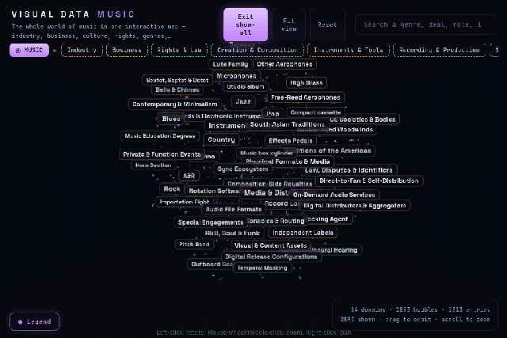

# Visual Data Music — the whole world of music as one navigable 3D network

[](https://vdata.liako.eu/music/)
[-f4f4f4?style=flat)](LICENSE)
[](https://threejs.org)
[](#)
[](#)
[](#running-locally)




**Live: [vdata.liako.eu/music](https://vdata.liako.eu/music/)**

The entire world of music as an interactive 3D network — **14 domains** (industry, business,
rights & law, creation & composition, instruments & tools, recording & production, sound &
technology, genres & styles, world traditions, performance & live, events, media &
distribution, roles & careers, education & scholarship) branching into more than **2,300
entries**, from the record deal to the raga. Fly through the transparent domain bubbles,
toggle domains in the legend, and search any genre, deal, role or instrument.

The music network (domains, sub-areas, entries and their descriptions) was compiled
editorially by [Liako](https://liako.eu) from public reference material.

## Running locally

No build step — plain JavaScript, [Three.js](https://threejs.org) and
[3d-force-graph](https://github.com/vasturiano/3d-force-graph) from CDN.

```bash
python3 -m http.server 8000   # → http://localhost:8000/
```

## Licence

Code is [MIT](LICENSE). **Not covered**: the compiled music dataset
(`includes/js/data.js`), and the LIAKO name and branding.

Sister projects: [visual-data-cosmos](https://github.com/liakomedia/visual-data-cosmos) ·
[visual-data-solar](https://github.com/liakomedia/visual-data-solar) ·
[visual-data-planet](https://github.com/liakomedia/visual-data-planet) ·
[visual-data-art](https://github.com/liakomedia/visual-data-art) — compiled by
[Liako](https://liako.eu).
